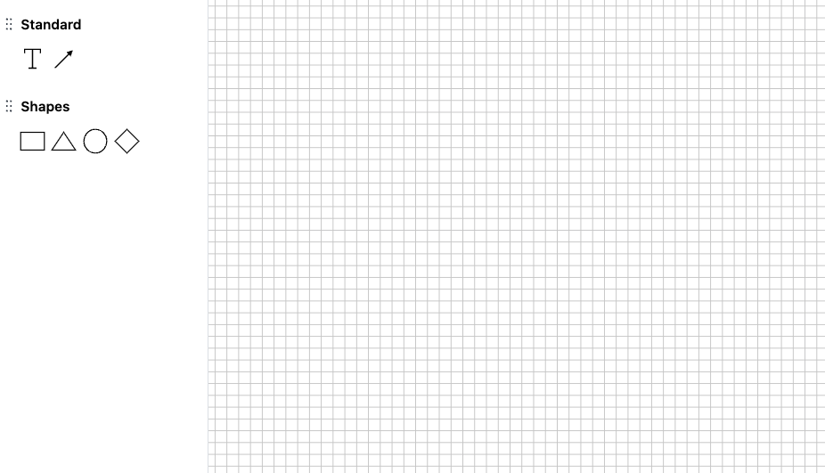
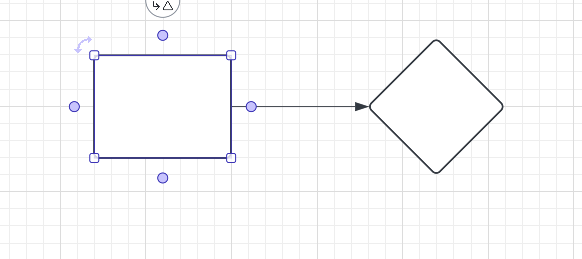

# mini Lucidchart

[Lucidchart](https://www.lucidchart.com) 是一个在线的图表绘制工具，可以绘制各种图表，包括流程图、组织结构图、思维导图等。

请在此仓库基础上完成一个迷你版的 Lucidchart。

## 步骤

- 注册 [lucidchart](https://www.lucidchart.com) 账号；
- 熟悉 lucidchart 的基本功能；
- fork 此仓库；
- IDE 安装 `Volar` 插件；
- 安装依赖`npm install`；
- 启动项目`npm run dev`；
- 访问 `http://localhost:5200`，查看项目；
- 完成功能；
- 记录如何完成项目的思路：比如需求拆分，代码设计，实现思路等，并随代码一起提交；
- 将代码推送到自己 fork 的仓库（不要提交 pr），最后将仓库地址发送给面试官；

## 需要完成的功能

项目启动后如下图所示：

左侧是工具栏，右侧是画布。
工具栏包括 Standard 和 Shapes 两个部分。  
其中 Standard 包括 `Text、Line`。Shapes 包括 `Rectangle、Triangle、Circle、Diamond`，这些在 lucidchart 中都有对应的形状。

现在需要模仿 lucidchart，完成将工具栏的元素拖拽添加到画布中， 并可以调整画布中的元素组成一个完整的 flowchart。

## 具体功能如下：

- 将工具栏的元素拖拽添加到画布中，`Line、Rectangle、Triangle、Circle、Diamond` 5 个元素，都需要都支持拖拽添加；
- 画布中的元素可以删除；
- 点击画布中的元素，可以选中元素，元素被选中后的状态，需要和 lucidchart 一致，如下图所示，元素的每个顶点会出现白色的点，每个边框上会出现一个蓝色的点；
- 当拖动元素，可以移动元素在画布中的位置；
- 当拖动白色的点，可以调整元素大小；
- 蓝色的点可以用来连接 `Line`，`Line`可以连接 `Rectangle、Triangle、Circle、Diamond`；

当元素被选中的状态：

## 加分项（可以不完成）：

- `Text`可以不完成，完成的话是加分项；
- `Line`连接某个元素后，当元素位置调整改变，`Line`需要自动调整位置，始终连接到元素上；
- 使用 `Typescript` 完成项目；

## 其他注意事项

- 在开发过程中，项目的 css 样式的细节不需要和 lucidchart 完全一致，能完成相应效果功能即可；
- 项目需要使用 vue 3 完成，如果使用其他框架，请自行重新创建项目；
- css 无限制，可以使用任何 css 框架，也可以使用原生 css；
- 可以修改项目中已有的代码，也可以调整目录结构，但是 `SideNav` 和 `Canvas` 组件需要保留，不能合并到一起；
- 可以使用任何库；
- 可以在 ai 的帮助下完成项目，但是需要自己理解代码，并进行修改；
- 需要记录完成项目的思路，请记录到 README.md 中；代码中也可以添加注释，请尽量详细；
